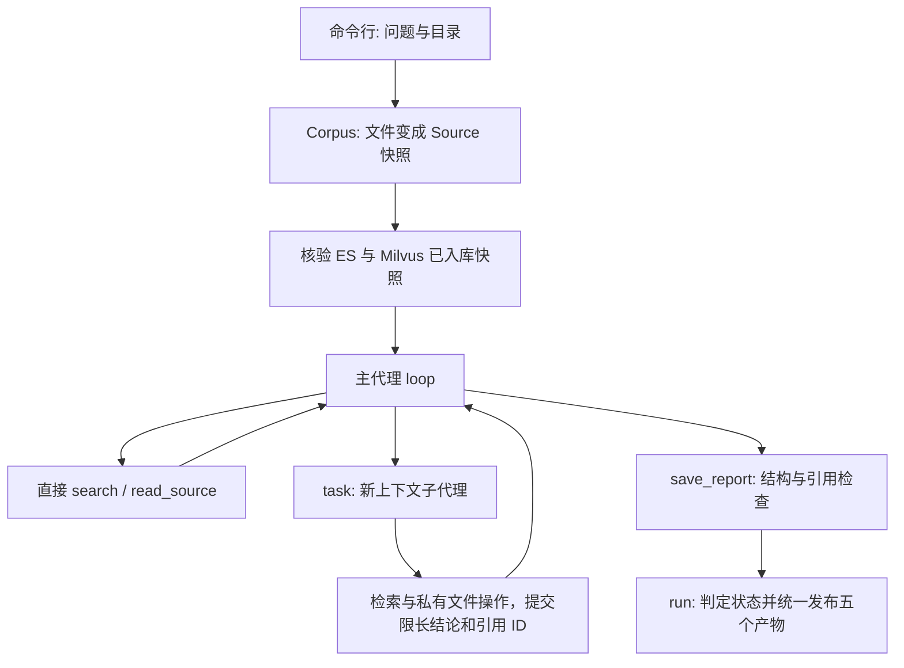

# DocResearch 项目理解：从一条命令到一份有出处的报告

这篇文章不是功能清单，也不要求你先懂 Python Agent 框架。我们只跟着一个问题走：

> 我有三份关于 pgvector、Milvus 和选型原则的资料。请比较两种方案用于小型知识库时的部署维护与检索能力；有依据才下结论，没有数据就说缺什么。

读完以后，你应该能自己画出“文件怎么变成模型看到的证据、模型怎么请求操作、子代理怎么返回、报告怎么写入”的过程。面试表述放在另一篇 [面试文档](INTERVIEW_GUIDE.md)，这里先把事情学明白。

**阅读顺序：** 第一次读第 1 至 8 节，跟着离线学习脚本看数据怎么变化；第二次读第 9 至 13 节，理解引用、失败与验证；最后做第 14 节的五个练习。暂时看不懂的源码细节不必硬背，先把输入到输出的路线走通。

## 1. 先看它替你做了什么

假设没有这个程序，你会怎样完成任务？

1. 打开三份资料，找到与部署、维护和检索相关的段落。
2. 分别整理 pgvector 和 Milvus 的情况。
3. 对照原文，合并相同内容，保留差异。
4. 写一份报告，给每条结论标注来自哪个文件、哪些行。
5. 没有延迟或费用数据，就写“没有这方面的数据”，而不是猜一个数字。

DocResearch 做的就是这件事。区别是：**模型负责提出下一步动作和组织结论，Python 代码负责真正查资料、执行动作、检查限制、保存文件。**

它的输入是“问题 + 本地资料目录”，输出是“报告 + 引用原文 + 运行记录”。不是通用编程助手，不会替你运行 Shell 或随意修改电脑文件。

正式检索由两个持久化服务完成：Elasticsearch 负责关键词，Milvus 负责向量。样例资料也恰好讨论 Milvus，但“资料研究对象”和“程序实际使用的检索服务”是两个角色；本项目没有使用 pgvector。离线 demo 另有内存教学后端，方便先看懂流程。

### 先运行，再读解释

在 PowerShell 中：

```powershell
cd E:\docresearch-agent
uv sync --extra dev
uv run docresearch demo
```

`uv sync` 按锁文件安装依赖，放在项目自己的 `.venv` 中；`uv run` 使用这套环境执行命令，不需要手动激活虚拟环境。

最后会打印一个新的 `reports/<run_id>/` 目录。每次的 ID 不一样，不必记它。

先只打开里面的 `report.md`，你会看到发现、资料缺口、来源三个部分。再打开 `sources.json`，这里保存的不是模型总结，而是被引用的原文。

**`demo` 不联网，也不调用真实大模型。** 它用一个固定回答的 `DemoModel` 演示完整程序流程，所以别人克隆仓库以后，不填密钥也能运行。真实模式叫 `run`，后面会讲两者哪里相同、哪里不同。

`demo` 的状态是 `partial`，正常退出码为 0。这不是安装失败：程序成功生成报告，同时明确保留“没有进行真实推理和性能对比”的缺口。

## 2. 命令究竟从哪里进入 Python

如果你更熟悉 TypeScript，可以先这样对应：

| Python 写法 | 在这里怎么理解 |
| --- | --- |
| `list` | 有顺序的数组，例如 `messages` |
| `dict` | 键值对象，例如一条工具结果 |
| `class` / 实例 | 一套操作和它持有的数据，例如 `Corpus` 对象 |
| `def` / `return` | 定义函数 / 返回结果 |
| `async def` / `await` | 定义可等待的异步操作 / 等待它完成 |
| `try ... finally` | 不管成功失败，都执行清理，例如关闭连接 |
| 类型注解 | 说明期望类型；普通注解本身不自动检查输入 |

`pyproject.toml` 把 docresearch 这个命令指向 `docresearch.cli:main`。因此运行命令之后，真正进入的是 [cli.py](../src/docresearch/cli.py) 的 `main()`。

它先用 argparse 把命令行文字解析成对象。例如 `--max-calls 24` 会把默认的 48 覆盖为 `args.max_calls == 24`。然后通过 `asyncio.run(execute(args))` 启动一次异步任务。

先忽略错误分支，把 `execute` 看成下面的顺序。**这是帮助理解的简化代码，不是另一个需要运行的实现。**

```python
corpus = Corpus(args.corpus)  # 读入资料
model = DemoModel()  # 选择模型适配器
research = ResearchRun(corpus, args.output, model)
outcome = await research.run(question)  # 执行一次研究
print(outcome.status, outcome.directory)
```

注意三个不同的时刻：

1. `Corpus(...)` 会真正读取文件，不是只记住一个目录名。
2. `ResearchRun(...)` 装配检索器、预算和写入器，还没有让模型研究问题。
3. `await research.run(question)` 先检查检索后端，再进入研究循环。正式后端使用已经入库的 ES/Milvus 快照；内存教学后端则在当次运行准备索引。

`await` 不是“新开一个线程”。它允许当前操作在等待网络时，让同一事件循环中的其他任务继续执行。后面的子代理并发依赖这一点。

### 一个能看到中间过程的学习脚本

```powershell
uv run python -X utf8 examples/walkthrough.py
```

它全程离线，使用项目真实的 `Corpus`、`Retriever`、参数模型和运行时，逐段打印中间数据。`-X utf8` 是为了在 Windows 终端和重定向时保持中文编码一致。

下面第 3 至 8 节讲数据与执行流程。学习脚本演示内存版本的算法和共同的 Agent 循环；第 4 节重点解释正式 ES/Milvus 实现。现在不必一次读完整个 `runtime.py`。

## 3. 第一件事：文件变成什么对象

入口是 [workspace.py](../src/docresearch/workspace.py) 的 `Corpus`。`Corpus` 可以理解为“这次任务允许使用的资料集合”。

程序先检查目录，再逐个读取 UTF-8 编码的 .md 和 .txt。隐藏文件、隐藏目录和符号链接会跳过；其他格式不会进入资料集。不是让模型直接打开任意路径。

### 为什么要分块

假设有一本几十万字的文档。每个问题都把整本书发给模型，费用高，也不容易集中注意力。我们先把文本拆成小段，查询时只返回最相关的几段。这样的段叫 **chunk，文本片段**。

本项目按完整行累计，接近 1800 字符就开始下一块，不把一行从中间切断，不做相邻块重叠。三份样例都很短，所以实际是 **3 个文件、3 个片段**，不是每篇强行切成多块。

单行超过 1800 字符会直接拒绝。这与“多行累计分块”是两件事：前者是输入约束，后者是切分规则。1800 是工程选定的上限，不是测出来的最优值。

### 一段原文不只是一条字符串

每个片段保存为一个 `Source`。样例中的真实对象大致如下，这里只缩短了 `version` 和 `text` 的展示：

```text
id          = e5a95ea4d55ef429
path        = pgvector.md
start_line  = 1
end_line    = 11
version     = 2dda04bb...       # 文件完整内容的 SHA-256，实际保存 64 位
text        = # pgvector 示例资料 ...
```

每个字段都在解决一个实际问题：

- `text`：模型到底看到了什么。
- `path` + `start_line` + `end_line`：人去哪里核对。
- `version`：文件修改过以后，怎么知道报告用的是哪个版本。
- id：检索、工具返回、报告引用之间，如何指向同一个片段。

`version` 是整个文件原始字节的哈希。id 则由相对路径、文件版本、行号和片段正文一起计算，取哈希前 16 位。它是内容相关的标识，不是数据库自增序号，也不是加密保护。

### 为什么称为“快照”

文件读进内存后，`Corpus.sources` 就保存了这些 `Source`。后面 `read_source(id)` 读取的是这个对象，不会再打开磁盘上的新版本。

例如，10:00 读入资料，10:01 文件被编辑，10:02 模型回读来源，拿到的仍是 10:00 的内容。这样检索与报告依据不会在任务中途变成两个版本。

这是任务内的一致性选择，不是数据库事务。多个文件是依次读取的，并没有保证在同一个瞬间拍下整个目录。

**检查自己是否懂了：** 只保存 `pgvector.md` 这个名字够不够？不够，既不知道引用了哪几行，也不知道之后是否改过内容。

## 4. 第二件事：ES 和 Milvus 怎样持久化并找到资料

先明确分工，避免把“数据库”当成一个可以代替所有步骤的盒子：

| 部件 | 保存或执行什么 | 不负责什么 |
| --- | --- | --- |
| Corpus | 本次读入的原文快照、行号、Source ID | 不保存长期向量索引 |
| Elasticsearch | 原文和元数据、倒排索引、IK 分词、BM25 排序 | 不生成向量 |
| Embedding 服务 | 将文本或查询变成数字向量 | 不保存检索索引 |
| Milvus | 持久保存向量，建立 HNSW 索引，按 COSINE 搜索 | 不写最终报告 |
| PersistentRetriever | 入库核验、两路检索、RRF、映射回 Source | 不判断答案一定正确 |

实现集中在 [stores.py](../src/docresearch/stores.py)。离线学习脚本使用 [retrieval.py](../src/docresearch/retrieval.py) 的内存对照实现，但正式命令默认使用 ES/Milvus。

### 4.1 为什么要区分入库和查询

原先每运行一次就把文档全部重新向量化，关掉程序向量就丢了。现在把长期准备工作叫 **ingest，入库**：

```text
ingest：
读取文件 -> 分块快照 -> 生成文档向量
                    -> ES 保存原文和关键词索引
                    -> Milvus 保存向量和 HNSW 索引
                    -> 两边核验完成 -> 发布 ready 记录
```

正常调研只做：

```text
run：
读取当前资料版本 -> 找到对应的 ready 快照
-> 模型请求 search
-> ES 关键词结果 + 查询向量 -> Milvus 向量结果
-> RRF 排序 -> Source 原文 -> 模型继续研究
```

只有第一次入库需要生成所有文档向量。相同资料和配置再次 ingest 会返回 reused=true，文档 Embedding 请求数为 0。查询仍需要生成当前问题的向量，不能说以后完全没有向量 API 成本。

配置好服务后实际运行：

```powershell
uv run docresearch ingest --corpus examples/corpus
uv run docresearch run "比较两种方案的部署维护，引用原文并指出缺口" --corpus examples/corpus
```

具体 Docker、凭据与分词配置见 [使用说明](RETRIEVAL_SETUP.md)。本机复用的是已有 ES 8.17.0 + IK、Milvus standalone v3.0.0，不重新创建或覆盖学习数据。

### 4.2 ES 怎么从字符串找到相关片段

先把原文分成可查词项，这个过程由 analyzer，也就是分词分析器完成。项目默认写入用 ik_max_word，查询用 ik_smart：前者细粒度切词，后者相对简洁地分析查询。分词模式属于索引配置，修改后需要新建快照。

每个 Source 写成 ES 的一个 document，_id 与 Source.id 相同。text 字段是全文检索字段，path/version/id 等是精确值字段。ES 为 text 建立倒排索引，可以直观理解为：

```text
PostgreSQL -> 包含这个词的 Source ID 列表
向量       -> 包含这个词的 Source ID 列表
维护       -> 包含这个词的 Source ID 列表
```

查询时程序给 ES 发 match 请求，ES 自己完成分词和 BM25 评分。Python 不扫描全部文档，也不手写 BM25。

先理解 BM25 的三个直觉：

1. 查询词在片段中出现，说明可能相关。
2. 所有片段都有的词区分度低，少数片段才有的词区分度高。
3. 重复次数与文档长度要校正，不能让最长文本天然占优。

项目查询只取 kind=source 的文档，避免把 ready 元数据作为资料召回；按相关分数降序取最多 20 条，分数相同用 Source ID 确定顺序。

离线脚本的 rank-bm25 则是另一种教学实现，它打印英文词、中文单字与双字。库已实现 BM25，没有手写算法。这套分词和“小语料非正分处理”不要误说成 ES 的实现。

### 4.3 Embedding 为什么能补充关键词

原文写“独立部署会增加监控、备份与数据同步”，查询写英文 monitoring backups synchronization，关键词重叠可能很少，但意思接近。

Embedding 服务把文本变成一串语义特征数字。不是给文档随便编号，也不能把每一维直接命名为“部署”或“成本”。

用可手算的二维向量理解，以下是教学数据，不是真实服务返回值：

```text
查询 q = (1, 0)
片段 A = (0.9, 0.1)
片段 B = (0.2, 0.8)

cos(q,A) = 0.9 / sqrt(0.9²+0.1²) ≈ 0.994
cos(q,B) = 0.2 / sqrt(0.2²+0.8²) ≈ 0.243
```

A 的方向更接近查询，所以语义通道倾向 A。0.994 不是“结论 99.4% 正确”，只是方向相似度。

真实样例使用 1024 维向量。入库每批最多 32 段，检查数量、维度、NaN/Inf、零向量，再归一化。相同的向量模型用于文档和查询，查询维度必须与集合一致。

### 4.4 Milvus 做了哪些内存矩阵没有做的工作

集合是 Milvus 中组织一批记录的单位，可以类比一张具有特定字段的表。本项目集合只有两个主要字段：

```text
id      VARCHAR(16)，主键，与 ES 的 _id 相同
vector  FLOAT_VECTOR，维度取真实 Embedding 返回值
```

原文只在 ES 和本次 Corpus 保存，不重复塞进每条向量记录。入库使用按主键 upsert，重复同一 ID 不产生第二个逻辑文档。

向量索引采用 HNSW + COSINE。HNSW 可理解为一张多层的近邻导航图：搜索时从较粗的层迅速靠近目标，再在底层扩展候选；它不是每次由 Python 对全部 N 个向量逐个算距离。近似搜索以效率换取可能漏掉某些真正最近邻的风险，不能宣称永不漏召回。

参数在代码中是 M=16、efConstruction=128、查询 ef=64：

- M 控制节点连接数量，影响内存与图的连通性。
- efConstruction 控制建图时探索候选的范围。
- ef 控制查询时探索范围，通常越大越愿意用延迟换召回。

这些是明确可复现的工程参数，没有宣称已针对大数据量寻优。Milvus 的 flush 用于请求完成落盘，load_collection 用于使集合可查询，Strong consistency 用于读取已完成写入的视图。它们与 ES 的 refresh 不是一回事：refresh 主要让新文档可被搜索。

### 4.5 两路结果如何合成一个列表

ES 和 Milvus 的原始分数不在同一量纲，不能直接把 BM25 的 8.2 与余弦的 0.8 相加。RRF 按名次融合，每条通道的贡献是 1/(60+rank)，rank 从 1 开始。

| 片段 | ES 名次 | Milvus 名次 | 融合分数 |
| --- | --- | --- | --- |
| A | 1 | 3 | 1/61 + 1/63 ≈ 0.03227 |
| B | 未进入候选 | 1 | 1/61 ≈ 0.01639 |

这次 A 更靠前。两路用同一个 Source ID 去重和累加，最后拿 ID 从已核对的 Corpus 找回完整原文。索引中的未知 ID 会触发错误，不直接当合法证据。

代码并发启动 ES 查询与“查询 Embedding -> Milvus 搜索”，都成功才融合。一边失败会取消并等待另一边，不悄悄把单路结果包装成混合检索成功。

RRF 不调用额外模型，不是 Cross-Encoder 重排。它简单、不依赖原始分数校准，但丢掉了分差信息。

### 4.6 文件改了，怎么保证不搜到旧段落

不是把所有版本无限塞进同一个集合，然后希望模型忽略旧内容。程序计算一个快照指纹，覆盖：

```text
Source ID 集合 + Embedding 服务/模型/人工版本的哈希
+ ES 分词配置 + 存储 schema 版本
```

由它生成 ES 索引与 Milvus 集合的共同名称：`docresearch_<namespace>_<指纹前缀>`。地址只以哈希参与，不把 key、端点写进 manifest。

文件新增、修改或删除，Source ID 集合变化，程序就选择不同名称。未入库的新快照直接报 IndexNotReady，不继续查询旧库。因此“删了文件又查出旧内容”的情况不会靠模型自行纠正。

模型提供方在同一名称下换了权重，程序无法自动知道。手动增加 EMBEDDING_REVISION 后再入库。旧快照保留，没有自动垃圾回收，会增加存储占用。

### 4.7 写两套数据库，中途失败会怎样

两库没有分布式事务。代码用一个简单但明确的可用性协议：

1. 用项目归属标记确认操作的是本项目索引/集合。
2. ES bulk 写原文，Milvus upsert 写向量并 flush。
3. 核对 ES 原文及 ID、Milvus ID 集合和维度，必须对应同一个 Corpus。
4. 全部通过后才在 ES 写 manifest，表示这个快照 ready。

中途失败可能留下部分物理数据，但没有 manifest 就不允许研究。用同一输入重跑 ingest，可以按确定 ID 再次写入尚未发布的快照。已经 ready 的快照不自动覆写，只校验和复用；如果被外部手动损坏，报 IndexMismatch。

prepare 读取 manifest 后仍核验两库，不把“有一条成功标记”当永久正确。这个小项目假设同一快照只有一个入库写者，不提供分布式锁；它不是跨数据库 ACID 事务，也没有在线增量更新或多用户隔离。

### 4.8 现在还保留哪些内存内容

Corpus 的原文快照和 Agent messages 仍在内存，这是为了本次证据一致性和对话执行。**持久向量索引在 Milvus，关键词倒排索引在 ES**。保留内存中的当前数据，不等于拿内存当数据库。

demo 和 walkthrough 为了零依赖教学，保留旧的内存检索器。它们都经同一个检索接口接到运行时；正式默认 run 使用 PersistentRetriever。服务失败不会触发自动回退。


## 5. 第三件事：模型怎么“使用工具”

### search 内部的 Agentic RAG 流程

底层 Retriever 只查候选；[agentic.py](../src/docresearch/agentic.py) 的 `AgenticSearch` 负责怎样组织查询、筛选证据和有限重试：

```text
原问题 -> 生成 1-2 条查询改写，同时保留原问题
       -> 最多 3 个查询并发执行 ES/Milvus 双路检索
       -> 每查询最多 8 个候选，跨查询按 ID 做 RRF，保留 8 个
       -> 可选 DashScope 专用 reranker
       -> LLM 对有用 ID 排序，并判断证据是否回答所问事实
       -> 证据不足且有新查询时，只补检索 1 轮
       -> 返回正文、sufficient、missing、attempts
```

例如问“哪个维护成本更低”：改写让关键词贴近资料；重排比较查询与候选的相关性；证据判断还要问“原文真的给了成本比较吗”。原文没给价格，就应返回缺口，不能搜到预算耗尽仍编一个数字。

改写使用 `QueryRewrite` 契约；评估使用 `EvidenceGrade`，包含 ordered_ids/sufficient/missing/retry_query。程序拒绝未知 ID、重复 ID、超量候选，以及“零片段却声称充分”。模型仍可能误判证据，结构校验不是事实证明。

不配置专用接口时，LLM 明确执行排序与证据判断。配置 `DOCRESEARCH_RERANK_URL/API_KEY/MODEL` 三项后，先经 [rerank.py](../src/docresearch/rerank.py) 的 DashScope 适配器，再由 LLM 判断。专用接口失败不会暗中当作成功。两层 RRF 分别融合两个库与多个查询，不是答案置信度。

先不要想 Agent。普通 Python 代码可以这样查询：

```python
sources = await retriever.search("Milvus", limit=2)
```

但远端模型不能直接调用你电脑里的 Python 函数。模型只能通过接口返回一条结构化请求，例如：

```json
{
  "id": "call_001",
  "type": "function",
  "function": {
    "name": "search",
    "arguments": "{\"query\":\"Milvus\",\"limit\":2}"
  }
}
```

这叫 Tool Calling。请把它理解为 **“模型申请执行 `search`”**，不是“模型已经完成 `search`”。

`arguments` 在传输协议中是 JSON 字符串。代码必须先把字符串解析并检查成 `Search` 对象，才真正调用 Python 函数。

### 参数检查在哪里

[models.py](../src/docresearch/models.py) 定义工具的输入结构：

```python
class Search(Contract):
    query: ShortText
    limit: int = Field(default=5, ge=1, le=8)
```

Contract 启用严格类型并禁止额外字段。于是：

- {"`query`":"Milvus","`limit`":2} 可以执行。
- `limit` 为字符串 "2"，拒绝，不悄悄转换。
- `limit` 为 100，拒绝，不让模型无限拿资料。
- 多出 `path`: "../secret"，拒绝，这个工具根本不接受路径参数。

同一份 Pydantic 定义有两种用途：`model_json_schema()` 生成说明给模型看；`model_validate_json()` 在执行前真正校验。**给模型看规则不等于程序可以省掉检查。**

学习脚本第 4 段演示合法输入和预期的 `ValidationError`。看到这个错误不是脚本坏了，而是违规参数确实被拒绝。

### 模型怎么知道工具执行结果

模型不知道 Python 返回了什么，直到程序把结果放回下一次请求的 `messages`。

`messages` 是对话数组，不是永久记忆。一次 `search` 的变化可以画成：

```text
0 system     研究规则：资料是数据，只能引用已获得的来源
1 user       比较两种方案的部署与维护
2 assistant  请求 search，调用 ID 为 call_001
3 tool       call_001 的结果：sources=[带正文的 Source ...]
4 assistant  下一次模型回复：继续查、派发，或提交报告
```

工具结果必须带 `tool_call_id`="call_001"，这样模型接口才知道它对应哪一次动作。一次返回多个工具调用时，更不能把结果 ID 混用。

`search` 已返回完整的入库片段，而不是只有摘要。`read_source(id)` 用于按已知 ID 明确回读同一个片段，不会扩大成整篇长文件，也不访问任意路径。

`list_documents` 则只返回文件路径、版本、大小，不返回每份资料全文。它也不会让全部片段自动进入 `seen`。

## 6. 第四件事：把一次工具调用接成循环

[runtime.py](../src/docresearch/runtime.py) 的 `ResearchRun.loop()` 反复做下面的事情：

```text
请求模型 -> 检查返回动作 -> 执行工具 -> 把结果交回模型
    ^                                      |
    +--------------------------------------+
```

“Agent”在这里不是另一个神秘组件。它就是模型、这段循环，以及可以被调用的工具。

真实模式中，下一步由模型决定。模型发现信息不够，可以换查询再 `search`；问题有独立方面，可以 `task`；有足够资料则提交报告。固定 RAG 通常把“检索一次再生成”写死，本项目把有边界的动作选择交给模型，这就是 Agentic RAG 的部分。

### 一轮循环里程序做什么

1. 先占用一次共享请求额度，再调用 `model.chat(messages, tools)`。
2. 把回复变成内部 `Reply`，里面有文字、`ToolCall` 列表和 `usage`。
3. 如果只有文字，就记录文字并提醒模型使用正式终止工具，不能仅凭“我完成了”保存报告。
4. 普通工具先检查角色权限，再检查参数，然后交给 `dispatch()`。
5. 工具结果按调用 ID 回填，进入下一轮。
6. 终止工具必须单独调用，结构和引用检查都通过才结束。

主代理终止工具是 save_report，子代理是 finish_research。子提交 findings/gaps；主提交标题、选中的子 finding_ids、自身检索所得 findings 和 gaps。两条证据路径在第 9 章区分。

save_report **不会立刻写磁盘**。先校验 SaveReport，再由 Coordinator 根据登记表展开为 Report；最外层 run 统一决定状态、收集来源、生成文件。

普通工具参数错了，会收到受控错误；Pydantic 反馈包含字段名和错误类型，不回显完整输入。模型可在剩余步数内修正。主子默认各最多 10 轮，每代理最多 search 3 次；最后两轮提示收尾，硬上限仍由程序执行。

### 三种“状态”别混在一起

| 名称 | 谁使用 | 存什么 |
| --- | --- | --- |
| `messages` | 发给模型 | 对话、动作请求、工具结果 |
| `AgentState` | Python 运行时 | 是否主代理、`seen`、`search` 次数 |
| `Budget` | 全部代理共享 | 全局调用数、工具数、`chat` `usage` |

模型说“我读过 pgvector.md”不能修改 seen。只有这个代理自己 search/read 得到正文才登记来源。子结果不修改主 seen，其结论走独立登记表。

## 7. 第五件事：为什么还需要子代理

单个代理已经能完成简单问题。子代理不是每次必须用，也不是越多越智能。

我们的比较任务可以拆成两个独立问题：“部署维护有什么差别”和“检索能力有什么差别”。它们都能直接读同一份资料，不必等待对方结论，适合并发研究。

“先比较方案，再核对比较结论”有依赖，不能盲目同时执行。主用 plan 显式声明 depends_on，程序检查重复 ID、未知依赖和环，并硬性等待依赖完成；它不自动证明语义依赖是否合理。

### task 实际执行了什么

先 plan，再 task。例如：

```json
{"tasks":[
  {"task_id":"pg","question":"研究 pgvector 部署约束","depends_on":[]},
  {"task_id":"mv","question":"研究 Milvus 部署约束","depends_on":[]},
  {"task_id":"check","question":"对照原文核对比较结论","depends_on":["pg","mv"]}
]}
```

主可同轮派发 task({task_id:"pg"}) 和 task({task_id:"mv"})；check 必须等待前两项成功。child 创建新 AgentState，调用同一个 loop，只接收问题与精简依赖结果。前置失败会让后继标记 dependency_failed，不永远卡在 pending。计划只能追加新 ID，不改写已完成问题。

**不是复制一份 Agent 代码，也不是另起一个 Python 进程。** `parent=False` 选择子角色的工具集合与轮数配置，`loop()` 自己创建新的 `system`/`user` 消息。主、子轮数可分别配置，但默认都为 10 轮。

| 内容 | 父子之间是否共享 |
| --- | --- |
| 资料快照 `Corpus`、检索索引 | 共享，避免重复读取和建索引 |
| 模型连接、全局 `Budget` | 共享，费用相关调用统一计数 |
| `messages` | 不共享历史，只交子问题和完成依赖的精简结果 |
| `AgentState.seen` / `searches` | 各自独立 |
| 文件工作区 | 每代理独立，同名 notes.md 不冲突 |
| 最终报告、再派发工具 | 子代理没有 |

主子都有 list_documents/search/read_source/read_file/write_file/edit_file。子还可 finish_research；主额外有 plan/task/save_report。**简单任务由主直接做，不强制创建子代理。** 子不能递归派发或保存最终报告，但能在自己工作区读写编辑笔记。

Schema 和 dispatch 是两层权限检查。子即使凭空构造 task/save_report 也会被拒绝；写权限不是全部取消，而是将路径绑定到本代理工作目录。

### 子代理把什么交回来

不是只交一句“pgvector 比较适合”，而是结构化结果。例如 `result` 部分可以是：

```json
{
  "findings": [
    {
      "statement": "资料说明，已有 PostgreSQL 的小型应用可以复用它保存向量。",
      "source_ids": ["e5a95ea4d55ef429"]
    }
  ],
  "gaps": ["资料没有提供同条件费用数据。"]
}
```

运行时校验后为每条发现分配 pg:f1 一类 finding_id。task 回传 task_id/status/findings/gaps/files；files 只有路径、hash、字节数。发现最多 6 条、缺口最多 4 条，单条文字最多 500 字符。子工具历史和 Source.text 不回传。

减少原文累积不等于彻底消除污染：摘要也可能误导或遗漏条件。主需要核对时，可以主动 read_source 或派验证任务；不是为了省 token 就禁止核验。

### 并发 2 和最多 4 个任务不是一回事

`asyncio.Semaphore(2)` 可以理解为两张执行通行证：同时最多两个 `child` 进入研究区。假设派发四个，第 3、4 个先等；某个完成并释放通行证后，后面的才能开始。

`max_tasks=4` 限制的是一次研究累计派发多少个。即使前四个都结束，也不能继续派发第五个。

所以“最多两个同时执行”不能代替“总共最多四个”。真实并发主要让两个网络等待重叠，不保证总耗时减半，更不保证结果更好。

## 8. 把已经学过的部分接回完整流程

现在再看整体图，里面的每个词应该都有具体含义：



全离线 `demo` 的固定顺序是：

```text
主代理：plan -> 两个 task -> save_report
每个子代理：search -> write_file -> read_file -> edit_file -> finish_research
每次 search 内部：改写 -> 检索 -> 排序与证据判断
```

CLI demo 为 17 次模拟请求和 14 次工具调用。请求包括改写与评估，工具包括计划、派发、文件操作和终止工具。模拟器固定这些决定，只用于观察程序流程，不代表真实效果。

真实简单任务已在 0 个子任务的情况下完成检索、写笔记、读回、编辑与报告。复杂流程的真实成功/失败边界见 [VALIDATION](VALIDATION.md)，不要把旧架构成功记录当作全部新路径都通过。文档向量在之前的 ingest 中生成。

两种模式都由 `Corpus` 提供原文快照，由 `ResearchRun` 执行工具循环，最后交给 `ArtifactWriter` 发布文件。不同的是两个可替换组件：demo 使用 `DemoModel` 和内存 `Retriever`，正式模式使用 `CompatibleModel` 和 `PersistentRetriever`。运行时通过统一的 `chat`、`prepare`、`search` 接口调用它们。这叫依赖注入：把“由谁回复、到哪里检索”与“怎么执行循环”分开，测试就不需要外部模型和数据库每次作出相同响应。

## 9. 报告的引用为什么可以核对，但不能保证正确

每个代理有自己的 seen。子提交的 source_ids 必须属于子 seen；主自身 findings 必须属于主 seen。主选择子 finding_ids 时，程序从成功任务登记表恢复原结论与引用，不让主改写陈述后仍假用子引用。

例：主仅收到 pg:f1 和摘要、没读 Source A，可以选择 pg:f1，但不能在自身 findings 中发明新陈述并引用 A。要补充判断，必须主动回读 A，或让子核验后形成新结论。

`validate_evidence()` 的关键逻辑很短：

```python
for finding in result.findings:
    if any(key not in state.seen for key in finding.source_ids):
        raise ValueError("Citation was not observed by this agent")
```

这能阻止引用一个不存在或没有见过的片段。但请看反例：

```text
原文：本资料没有给出百万向量的延迟数据。
模型结论：百万向量查询延迟为 10 毫秒。
引用：恰好引用了上述原文的真实 ID。
```

ID 检查可能通过，结论仍然错误。因为“出处存在”与“原文支持这个说法”是两个不同问题。

本项目处理前者，并把原文保存下来方便人工核对后者；没有自动的事实蕴含判定器。面试时应说“引用来源可追溯”，不说“彻底消除幻觉”。

## 10. 如果模型一直查、不结束，怎么办

不要指望只在 prompt 里写“尽快结束”。停止条件必须由程序维护。

| 限制 | 默认值 | 防什么问题 |
| --- | --- | --- |
| 聊天 + Embedding + 专用 rerank 请求数 | 48 | 包括改写与证据评估 |
| 计数工具调用 | 64 | 单次响应带出很多工具请求 |
| 主 / 子代理循环轮数 | 10 / 10 | 只说话不结束，或不断返回错误参数 |
| 每代理 `search` 次数 | 3 | 无限改写检索 |
| 子任务总数 / 并发数 | 4 / 2 | 无限制拆分 / 同时压满服务 |
| 单请求 / 研究区间超时 | 30 / 180 秒 | 外部服务卡住、研究一直不完成 |

不是每个数字都能从 CLI 设置。CLI 暴露 `--max-calls` 和 `--timeout`，其他默认值在 [models.py](../src/docresearch/models.py) 的 `Limits` 中。

### 为什么两个子代理同时请求，不会抢过预算

`Budget.invoke()` 的顺序是先检查、先加一，最后才 `await`。简化后是：

```python
if self.calls >= self.limits.max_calls:
    raise BudgetExceeded("Model call budget exhausted")
self.calls += 1
return await function()  # 原实现还包裹了单请求 timeout
```

同一个 `asyncio` 事件循环里，在没有 `await` 的这几行之间不会切换协程。额度先预留，之后才等待网络，因此另一个 `child` 看到的计数已经更新。请求失败也占这一次，不退回。

这不是跨线程、跨进程的锁。将来变成多个服务器共享额度，必须另外设计原子存储或事务。

### 错了以后不能只退出父函数

同一轮多个工具通过 `create_task` 启动，`gather` 等待结果。一个失败时，其他任务可能还在执行，所以 `finally` 会做两步：

```text
给未完成的兄弟任务发 cancel
再 await gather(..., return_exceptions=True)，等它们清理退出
```

`cancel` 是取消请求，不是远端退款按钮。已经到达提供方的请求仍可能生成并计费。

总 `timeout` 覆盖后端 prepare 检查和 Agent 循环；ingest 是另一项受预算与时间限制的操作。CLI 前面的同步文件读入、最后的同步写出不在这个 `timeout` 中。它不是整个操作系统进程的硬超时。

### 状态应该怎么读

| 状态 | 含义 | 正式报告 |
| --- | --- | --- |
| `completed` | 接受了结构化报告，未报告缺口且没有 `child` 失败 | 有 |
| `partial` | 有报告，但有资料缺口或子任务失败 | 有 |
| `budget_exhausted` | 全局调用或工具额度用尽 | 无 |
| `timeout` | 总超时或传播到主运行的请求超时 | 无 |
| `failed` | 轮数耗尽、协议异常等其他失败 | 无 |

后三种通常仍保存四个诊断 JSON，包括任务状态 tasks.json。启动参数、空资料或磁盘写入失败可能发生在这个收尾范围之外，不保证有产物；Ctrl+C 也不保证写完。

局部 `child` 超时可以被转为失败结果交回父代理，父代理仍可输出 `partial`。全局预算耗尽则继续向上传播，终止整次研究。

`completed` 只是程序状态，不是内容质量认证。请求数预算也不是金额预算：`chat` `usage` 只做统计，没有精确金额预留或完整的输入 token 裁剪。

## 11. 最后一步：文件由谁写，写到哪里

`Report` 只有标题、发现和缺口，没有用户可控输出路径。`run()` 统一渲染 Markdown，收集引用原文，再交给 `ArtifactWriter`。

| 文件 | 你应该拿它回答什么问题 |
| --- | --- |
| `report.md` | 结论是什么？缺哪些资料？ |
| `sources.json` | 报告引用的原文到底是什么版本？ |
| `trace.json` | 哪个代理何时开始请求、执行哪个工具、在哪里结束？ |
| `run.json` | 状态、调用数、工具数、并发峰值、耗时、限制是多少？ |
| `tasks.json` | 计划中的依赖是什么？每项任务的状态和精简结果是什么？ |

输出目录必须与资料目录互不包含。每次使用新 run ID，最终产物名只允许这五种；中间工作文件写到 reports/workspaces/<run_id>/<agent_id>/，与最终发布目录分开。

单文件先写同目录临时文件，再 os.replace 到目标；五个文件不是同一事务，磁盘出错可能留下部分发布目录。

### 主子代理怎样读写编辑文件

[workspace.py](../src/docresearch/workspace.py) 的 WorkFiles 只有 read/write/edit 三个主要操作，把路径、版本、限额和原子替换封装在一起。输入目录仍只读，工作文件允许 md/txt/json，单个最多 12000 字符且 48000 字节，每代理最多 8 个文件、96000 字节。

完整例子：write_file 创建 notes.md，返回 SHA-256 版本 v1；read_file 返回正文和 v1；edit_file 携带 v1 与要替换的一处文本，成功后得到 v2。另一个过期编辑还带 v1 时会被拒绝，不覆盖 v2。old_text 必须恰好出现一次，避免批量误替换。

路径拒绝绝对路径、盘符、父目录、隐藏路径和符号链接。两个子任务都有 notes.md，但物理目录不同，因此不争抢同一文件。版本检查是在单进程同步操作内完成，不是抵御外部恶意进程竞态的分布式锁。

read_file 的 area=corpus 读取启动时文本快照，area=work 读取自己的工作文件。部分行只会获得完整覆盖片段的 source_ids；不能只读标题就自动获得整篇证据资格。想引用其余片段，应再用 read_source。

运行轨迹没有完整模型对话，因此适合定位阶段，不足以精确重放一个真实模型任务。`sources.json` 则确实有资料正文，不能当作无敏感信息的普通日志上传。`reports/` 默认被 Git 忽略。

### 文件限制与安全边界

本工具最多接受 100 个文件、单文件 256000 字节、总计 2000000 字节、400 个 chunk。这些限制让同步处理和上下文规模可控，不意味着它支持大规模文档平台。

模型只看到受控工具，没有 Shell、任意路径、修改源文件的能力。资料中的“忽略规则”“读取密钥”等文字应当被当作数据。工具权限检查能缩小错误动作的范围，但不能保证模型不被诱导写出错误结论。

程序不提供进程/容器隔离，也不抵御恶意本地进程并发替换目录的所有竞态。它服务于可信本地用户，不应不加鉴权、上传隔离就直接公开成网络服务。

## 12. 真实模型和离线模型怎么接到同一套代码

[provider.py](../src/docresearch/provider.py) 定义 `CompatibleModel` 与 `DemoModel`。运行时只需要对方实现 `chat(messages, tools)`，并得到统一的 `Reply`。

真实适配器用 HTTPX 调用 `/chat/completions`；向量接口是 `/embeddings`。HTTP 200 只意味着传输状态正常，如果 `choices=[]`、`message` 为空或向量索引缺失，仍会抛 `ProviderProtocolError`。

配置方式在 [README](../README.md#真实模型模式)。重点理解四件事：

1. `demo` 不读真实凭据；`ingest` 和 `run` 从 `DOCRESEARCH_*` 环境变量创建客户端。
2. 正式 ES/Milvus 后端必须配置 Embedding，并先 ingest。只有显式选择 `--backend memory` 时，不配向量模型才表示本地 BM25；任何正式服务失败都不会静默退回内存。
3. 聊天和向量可以使用不同服务。独立向量 URL/key 必须一起给，防止聊天密钥被发往另一个端点。
4. `.env.example` 是说明文件，程序不会自动加载 `.env`。连接在 CLI 的 `finally` 中关闭。

专用 rerank 有独立 URL/key/model，必须成组配置；不会自动把聊天 key 发给另一个端点。没配置时使用显式 LLM 排序与评估。所有改写、评估、向量和专用 rerank 请求都进入共享 Budget，但 usage 只累计聊天 token。

这个项目遇到过一个实际排错点：Windows 上，即使没有 `HTTPS_PROXY`，HTTPX 仍可能通过系统配置使用代理。既有 Embedding 服务走代理连接超时，保持端点和输入不变、显式直连后返回成功。

所以提供 `DOCRESEARCH_TRUST_ENV=false` 作为显式选择，不自动猜路由。它关闭环境/系统代理和环境证书配置，仍开启 TLS 证书验证。企业网络依赖代理或自定义 CA 时不能照搬这个选项。

**资料在本地，不代表推理也在本地。** 真实聊天会把问题及检索到的正文发给提供方；开启 Embedding 会发送全部入库片段。真实验收只使用自编样例，没有上传私人简历或个人资料。

## 13. 怎么判断项目真的能运行，而不只是看起来能

现在再理解三种不同的验证，目的就很清楚了。

### 确定性测试：代码规则有没有兑现

```powershell
uv run pytest -q
uv run ruff check .
uv run ruff format --check .
```

例如“子代理不能写 corpus、其他代理工作区和最终报告，但可以读写自己的笔记”“预算不能超额”“文件修改后仍返回旧快照”，这些是代码规则，用固定输入就能验证，不需要大模型随机回答。

测试中的假模型会故意返回错误引用、慢响应或重复调用 ID，检查运行时是否处理正确。HTTP MockTransport 则替代网络，检查 URL、认证与响应解析。它们不是模型准确率测试。

### 真实链路：提供方能不能完成这类任务

持久化 ES/Milvus 的真实入库、重复复用与旧版双子代理报告已有[存档](evidence/controlled-live-es-milvus/report.md)。新的按需委派架构已跑通[主代理直接研究与读写](evidence/adaptive-simple/report.md)，0 个子任务，实际经过查询改写、专用重排和证据评估。新复杂流程首次真实运行耗尽预算；修复后的复测在首请求遇到 HTTP 402，因此复杂流程目前只有确定性测试通过，不能用旧报告替代新架构验收。真实服务集成测试另外用合成向量验证重连复用、资料删除后换快照和存储损坏拒绝读取。

这证明选定接口、Tool Calling 和真实向量能协同工作。不代表所有兼容服务都正常，也不代表已有真实用户使用。

### 标注小测：召回了应该找到的资料吗

```powershell
uv run python -X utf8 -m docresearch.evaluation
# 已配置并入库后，对照正式服务（会调用真实查询向量）：
uv run python -X utf8 -m docresearch.evaluation --backend es-milvus
```

评测命令不调用聊天模型，也不调用 `AgenticSearch` 的改写、重排、评估和重试。它从 `examples/retrieval_cases.json` 读取 20 道预先标注的问题，逐题查询基础检索后端；答案标签只用于评分，不会交给检索器。因此以下数字只衡量基础召回，不能解释成完整 Agentic RAG 的质量。

其中 16 题有答案，4 题没有。对有答案题，取前两个 chunk，看它们覆盖多少个预期文档。例如一道题需要 A、B 两篇，实际只找到 A，就得到 1/2 的 recall。最后取 16 题平均值。

在这组只有 3 个片段的教学集上，旧内存 BM25 / 内存混合检索的 document recall@2 是 0.875 / 1.000；正式 ES/Milvus 为 0.96875，top-1 为 0.9375。换存储后第一名表现与候选覆盖并非一起提升，**不能宣称换数据库就一定更准，也不能把这个小样例推广为生产提升。**

更重要的是：4 道无答案题，三种后端都返回了候选。例如问“百万向量 P95 延迟多少毫秒”，原文虽包含“百万向量”“延迟”，却明确没有数值。程序必须阅读原文、记录 gap，不能见到检索命中就编答案。

详细定义、逐题结果、耗时和调用数见 [VALIDATION.md](VALIDATION.md)。要扩展为真正的质量评估，还需要更大、独立标注的语料与问题，以及答案是否被原文支持的人工检查。

## 14. 五个练习，把“看过”变成“会解释”

每次只做一个。下面有预期现象，先自己观察，再看说明。

### 练习一：认出一个 Source

```powershell
uv run python -X utf8 examples/walkthrough.py
```

看第 1 段，指出路径、行号、版本、正文分别在哪。然后回答：文件编辑后，旧 report 引用的是旧内容还是新内容？答案是保存下来的旧快照。

### 练习二：解释检索不等于回答

```powershell
uv run python -X utf8 -m docresearch.evaluation
```

找到“P95 延迟是多少”的用例。它的 `expected_documents` 是空，返回的候选却非空。打开候选原文，说明为什么它不能回答具体数字。

### 练习三：亲眼看预算阻止后续动作

```powershell
uv run docresearch demo --max-calls 1
```

这条命令预期退出码为 1。主模型的第一次模拟回复用掉额度；子代理请求无法继续。应看到 `budget_exhausted`，新目录里有诊断 JSON，没有 `report.md`。不是把旧目录中的报告删除了，每次都是新目录。

### 练习四：看程序怎样拒绝非法引用与写入

```powershell
uv run pytest tests/test_runtime.py -q -k "citation_must_be_seen or child_cannot_delegate_or_publish"
uv run pytest tests/test_coordination.py tests/test_workfiles.py -q
```

打开同名测试：它故意注入坏动作，断言代码拒绝。测试通过意味着“拒绝行为符合预期”，不是坏动作执行成功。

### 练习五：解释并发与清理

```powershell
uv run pytest tests/test_runtime.py -q -k "shared_budget or timeout_cancels_children or tool_budget_and_concurrency_one"
```

先回答三句：一个 Semaphore 控制同时执行数量；一个 `Budget` 控制全局请求总数；`finally` 中 `cancel` 后还要等待清理。再去测试里找对应断言。

## 15. 最后按这条路线读源码

你已经知道每个数据代表什么，再按下面顺序看完整实现，比较不容易迷路：

| 顺序 | 入口 | 带着什么问题看 |
| --- | --- | --- |
| 1 | [cli.py](../src/docresearch/cli.py) `main` / `execute` | 用户参数怎样变成一次运行？ |
| 2 | [workspace.py](../src/docresearch/workspace.py) `Corpus` / `Source` | 原文、行号和版本如何保存？ |
| 3 | [stores.py](../src/docresearch/stores.py) `ingest` / `prepare` / `search` | ES/Milvus 如何持久化、核验和检索？ |
| 3a | [retrieval.py](../src/docresearch/retrieval.py) | 离线对照和 RRF 小函数如何工作？ |
| 4 | [models.py](../src/docresearch/models.py) `Search` / `Finding` / `Report` | 哪些输入会被拒绝？ |
| 5 | [provider.py](../src/docresearch/provider.py) `chat` / `embed` | HTTP 如何变成统一回复？ |
| 6 | [runtime.py](../src/docresearch/runtime.py) `loop` / `dispatch` / `child` | 动作如何执行、结果如何返回？ |
| 7 | 同文件 `Budget` / `run` / `render` | 何时停、如何定状态和生成报告？ |
| 8 | [workspace.py](../src/docresearch/workspace.py) `ArtifactWriter` | 副作用为何集中在最后？ |
| 9 | [evaluation.py](../src/docresearch/evaluation.py) | 检索表现怎样被量化，而不冒充答案准确率？ |

源码不需要一次背完。先能用自己的话说清这段话，再去准备面试：

> 文件先变成带出处的快照。检索流程改写查询、融合召回、重排并判断证据，必要时补一次检索。主可直接读写工作文件，也可把复杂问题交给独立上下文与私有目录的子代理。子只回传限长结论，主需要时再核对原文；最后程序校验来源与结论登记表，保留缺口并统一生成报告。
