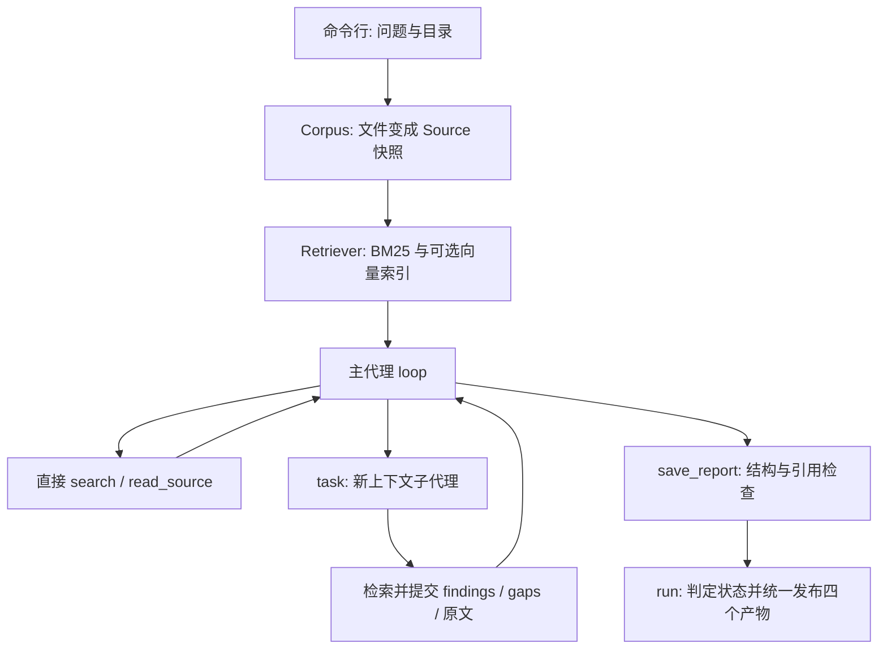

# DocResearch 项目理解：从一条命令到一份有出处的报告

这篇文章不是功能清单，也不要求你先懂 Python Agent 框架。我们只跟着一个问题走：

> 我有三份关于 pgvector、Milvus 和选型原则的资料。请比较两种方案用于小型知识库时的部署维护与检索能力；有依据才下结论，没有数据就说缺什么。

读完以后，你应该能自己画出“文件怎么变成模型看到的证据、模型怎么请求操作、子代理怎么返回、报告怎么写入”的过程。面试表述放在另一篇 [面试文档](INTERVIEW_GUIDE.md)，这里先把事情学明白。

**阅读顺序：** 第一次读第 1 至 8 节，跟着离线学习脚本看数据怎么变化；第二次读第 9 至 13 节，理解引用、失败与验证；最后做第 14 节的五个练习。暂时看不懂的源码细节不必硬背，先把输入到输出的路线走通。

## 1. 先看它替你做了什么

假设没有这个程序，你会怎样完成任务？

1. 打开三份资料，找到与部署、维护和检索相关的段落。
2. 分别整理 pgvector 和 Milvus 的情况。
3. 对照原文，合并相同内容，保留差异。
4. 写一份报告，给每条结论标注来自哪个文件、哪些行。
5. 没有延迟或费用数据，就写“没有这方面的数据”，而不是猜一个数字。

DocResearch 做的就是这件事。区别是：**模型负责提出下一步动作和组织结论，Python 代码负责真正查资料、执行动作、检查限制、保存文件。**

它的输入是“问题 + 本地资料目录”，输出是“报告 + 引用原文 + 运行记录”。不是通用编程助手，不会替你运行 Shell 或随意修改电脑文件。

有一个容易混淆的点：资料讨论 pgvector 和 Milvus，不代表项目安装了这两个数据库。它们是研究对象；本项目自己的检索使用 rank-bm25 和内存向量计算。

### 先运行，再读解释

在 PowerShell 中：

```powershell
cd E:\docresearch-agent
uv sync --extra dev
uv run docresearch demo
```

`uv sync` 按锁文件安装依赖，放在项目自己的 `.venv` 中；`uv run` 使用这套环境执行命令，不需要手动激活虚拟环境。

最后会打印一个新的 `reports/<run_id>/` 目录。每次的 ID 不一样，不必记它。

先只打开里面的 `report.md`，你会看到发现、资料缺口、来源三个部分。再打开 `sources.json`，这里保存的不是模型总结，而是被引用的原文。

**`demo` 不联网，也不调用真实大模型。** 它用一个固定回答的 `DemoModel` 演示完整程序流程，所以别人克隆仓库以后，不填密钥也能运行。真实模式叫 `run`，后面会讲两者哪里相同、哪里不同。

`demo` 的状态是 `partial`，正常退出码为 0。这不是安装失败：程序成功生成报告，同时明确保留“没有进行真实推理和性能对比”的缺口。

## 2. 命令究竟从哪里进入 Python

如果你更熟悉 TypeScript，可以先这样对应：

| Python 写法 | 在这里怎么理解 |
| --- | --- |
| `list` | 有顺序的数组，例如 `messages` |
| `dict` | 键值对象，例如一条工具结果 |
| `class` / 实例 | 一套操作和它持有的数据，例如 `Corpus` 对象 |
| `def` / `return` | 定义函数 / 返回结果 |
| `async def` / `await` | 定义可等待的异步操作 / 等待它完成 |
| `try ... finally` | 不管成功失败，都执行清理，例如关闭连接 |
| 类型注解 | 说明期望类型；普通注解本身不自动检查输入 |

`pyproject.toml` 把 docresearch 这个命令指向 `docresearch.cli:main`。因此运行命令之后，真正进入的是 [cli.py](../src/docresearch/cli.py) 的 `main()`。

它先用 argparse 把命令行文字解析成对象。例如 `--max-calls 24` 会变成 `args.max_calls == 24`。然后通过 `asyncio.run(execute(args))` 启动一次异步任务。

先忽略错误分支，把 `execute` 看成下面的顺序。**这是帮助理解的简化代码，不是另一个需要运行的实现。**

```python
corpus = Corpus(args.corpus)  # 读入资料
model = DemoModel()  # 选择模型适配器
research = ResearchRun(corpus, args.output, model)
outcome = await research.run(question)  # 执行一次研究
print(outcome.status, outcome.directory)
```

注意三个不同的时刻：

1. `Corpus(...)` 会真正读取文件，不是只记住一个目录名。
2. `ResearchRun(...)` 装配检索器、预算和写入器，还没有让模型研究问题。
3. `await research.run(question)` 才开始准备可选向量索引并进入研究循环。

`await` 不是“新开一个线程”。它允许当前操作在等待网络时，让同一事件循环中的其他任务继续执行。后面的子代理并发依赖这一点。

### 一个能看到中间过程的学习脚本

```powershell
uv run python -X utf8 examples/walkthrough.py
```

它全程离线，使用项目真实的 `Corpus`、`Retriever`、参数模型和运行时，逐段打印中间数据。`-X utf8` 是为了在 Windows 终端和重定向时保持中文编码一致。

下面第 3 至 8 节分别对应这个脚本的输出。现在不必一次读完整个 `runtime.py`。

## 3. 第一件事：文件变成什么对象

入口是 [workspace.py](../src/docresearch/workspace.py) 的 `Corpus`。`Corpus` 可以理解为“这次任务允许使用的资料集合”。

程序先检查目录，再逐个读取 UTF-8 编码的 .md 和 .txt。隐藏文件、隐藏目录和符号链接会跳过；其他格式不会进入资料集。不是让模型直接打开任意路径。

### 为什么要分块

假设有一本几十万字的文档。每个问题都把整本书发给模型，费用高，也不容易集中注意力。我们先把文本拆成小段，查询时只返回最相关的几段。这样的段叫 **chunk，文本片段**。

本项目按完整行累计，接近 1800 字符就开始下一块，不把一行从中间切断，不做相邻块重叠。三份样例都很短，所以实际是 **3 个文件、3 个片段**，不是每篇强行切成多块。

单行超过 1800 字符会直接拒绝。这与“多行累计分块”是两件事：前者是输入约束，后者是切分规则。1800 是工程选定的上限，不是测出来的最优值。

### 一段原文不只是一条字符串

每个片段保存为一个 `Source`。样例中的真实对象大致如下，这里只缩短了 `version` 和 `text` 的展示：

```text
id          = e5a95ea4d55ef429
path        = pgvector.md
start_line  = 1
end_line    = 11
version     = 2dda04bb...       # 文件完整内容的 SHA-256，实际保存 64 位
text        = # pgvector 示例资料 ...
```

每个字段都在解决一个实际问题：

- `text`：模型到底看到了什么。
- `path` + `start_line` + `end_line`：人去哪里核对。
- `version`：文件修改过以后，怎么知道报告用的是哪个版本。
- id：检索、工具返回、报告引用之间，如何指向同一个片段。

`version` 是整个文件原始字节的哈希。id 则由相对路径、文件版本、行号和片段正文一起计算，取哈希前 16 位。它是内容相关的标识，不是数据库自增序号，也不是加密保护。

### 为什么称为“快照”

文件读进内存后，`Corpus.sources` 就保存了这些 `Source`。后面 `read_source(id)` 读取的是这个对象，不会再打开磁盘上的新版本。

例如，10:00 读入资料，10:01 文件被编辑，10:02 模型回读来源，拿到的仍是 10:00 的内容。这样检索与报告依据不会在任务中途变成两个版本。

这是任务内的一致性选择，不是数据库事务。多个文件是依次读取的，并没有保证在同一个瞬间拍下整个目录。

**检查自己是否懂了：** 只保存 `pgvector.md` 这个名字够不够？不够，既不知道引用了哪几行，也不知道之后是否改过内容。

## 4. 第二件事：怎么从片段中找出相关内容

现在手里有 3 个 `Source`，问题是：“PostgreSQL 全文检索”。[retrieval.py](../src/docresearch/retrieval.py) 的 `Retriever.search(query, limit)` 负责返回少量候选 `Source`。

重要的是：**检索器只负责找候选原文，不负责生成答案，也不负责证明候选足以回答问题。**

RAG 是 Retrieval-Augmented Generation，中文叫“检索增强生成”：先找资料，再让模型参考找到的内容回答。它不会重新训练模型，而是把相关原文放进这次请求的上下文。接下来先学“检索”这一半，第 5 节以后再把生成和动作选择接上。

### 4.1 先把文本变成词项

`tokenize` 做了英文小写化、英文词提取、中文单字及相邻双字提取。对上述查询，学习脚本会打印：

```text
postgresql, 全, 文, 检, 索, 全文, 文检, 检索
```

这里的 token 是检索用的词项，不是大模型 API 计费的 token。两个概念不要混为一谈。

为什么既有“全”“文”，又有“全文”？单字容易匹配中文，但太宽；双字能保留一点相邻关系。它比成熟中文分词粗糙，不过依赖少、行为容易观察。

### 4.2 BM25 是怎样打分的

BM25 是成熟的关键词排序方法，本项目调用 rank-bm25 库，不自己重写算法。先理解三个直觉：

1. 查询词在片段中出现，说明可能相关。
2. 所有片段都有的词，区分度低；少数片段才有的词，区分度高。
3. 长片段不能只因为字数多、重复词多就天然占优势，需要长度校正和词频饱和。

代码把每个片段的词项列表交给 `BM25Okapi` 建立统计。查询时，`get_scores(query_tokens)` 给每个片段打分。

本项目还加了一条过滤：片段必须与查询至少有一个词项重叠。没有直接用 `score > 0`，因为在极小语料中，BM25 分数也可能是零或负数，不能因此删掉所有真实匹配。

学习脚本里，该查询的前两项是 `pgvector.md`、`milvus.md`。第二项也被召回，不意味着它就是最佳答案；“检索”等常见词会产生较宽的匹配。

### 4.3 关键词检索为什么不够

看两个表达：

```text
原文：独立部署会增加监控、备份和数据同步工作。
查询：independent scaling monitoring backups synchronization
```

人知道两者相关，但字符重叠很少。BM25 不会自动把英文短语理解成中文含义。**Embedding，文本向量化**，就是另一种表达文本的方法：让模型把一段话编码成一串数字，使含义相近的文本方向相近。

不是给每个文档随便编号。向量的每一维通常也不能直接命名成“部署”“成本”。

### 4.4 用一个可以手算的向量例子

下面是教学用的二维向量，不是真实服务返回的数据：

```text
查询 q  = (1, 0)
片段 A  = (0.9, 0.1)
片段 B  = (0.2, 0.8)
```

把每个向量除以自己的长度，叫 L2 归一化。归一化之后，两向量点积等于余弦相似度：

```text
cos(q, A) = 0.9 / sqrt(0.9² + 0.1²) ≈ 0.994
cos(q, B) = 0.2 / sqrt(0.2² + 0.8²) ≈ 0.243
```

A 的方向更接近查询，所以向量通道把 A 排在前面。**0.994 不是“答案有 99.4% 的概率正确”**，只是向量方向接近程度。

学习脚本第 3 段用真实的 `normalized` 函数计算这个例子。真实验收使用的是 1024 维向量，代码不写死这个维度，而是检查文档向量与查询向量是否一致。

`prepare()` 每批最多 32 个片段请求向量，保存在内存。`search()` 再请求当前查询的向量，用 NumPy 矩阵点积得到所有片段的余弦相似度。没有持久化向量数据库，每次运行会重新建索引。

在计算前必须拒绝数量不符、维度不符、NaN/Inf 和零向量。否则可能不是“效果差”，而是计算本身没有意义。

### 4.5 两个排序怎么合并

关键词通道和向量通道各取最多 20 个候选。它们的原始分数不是同一量纲，不能直接把 BM25 的 8.2 与余弦的 0.8 相加。

项目使用 RRF，意思是**按名次合并排序**。每条通道的贡献是 1 / (60 + 名次)，名次从 1 开始。

用一个假设排名演算：

| 片段 | BM25 名次 | 向量名次 | 合并分数 |
| --- | --- | --- | --- |
| A | 1 | 3 | 1/61 + 1/63 ≈ 0.03227 |
| B | 未进入候选 | 1 | 0 + 1/61 ≈ 0.01639 |

这次 A 最终在前，因为两个通道都推荐了它。这不是“两个通道永远一定胜过一个”的通用规律，要看实际名次和候选设置。

代码用同一个片段索引累加分数，最终输出对应的 `Source`。平分时按稳定片段 ID 排序，避免测试每次顺序变化。

RRF 不调用另一个模型，也不是 Cross-Encoder 重排。它的优点是简单、不需要先校准两套分数；代价是丢掉了原始分数的距离信息。

## 5. 第三件事：模型怎么“使用工具”

先不要想 Agent。普通 Python 代码可以这样查询：

```python
sources = await retriever.search("Milvus", limit=2)
```

但远端模型不能直接调用你电脑里的 Python 函数。模型只能通过接口返回一条结构化请求，例如：

```json
{
  "id": "call_001",
  "type": "function",
  "function": {
    "name": "search",
    "arguments": "{\"query\":\"Milvus\",\"limit\":2}"
  }
}
```

这叫 Tool Calling。请把它理解为 **“模型申请执行 `search`”**，不是“模型已经完成 `search`”。

`arguments` 在传输协议中是 JSON 字符串。代码必须先把字符串解析并检查成 `Search` 对象，才真正调用 Python 函数。

### 参数检查在哪里

[models.py](../src/docresearch/models.py) 定义工具的输入结构：

```python
class Search(Contract):
    query: ShortText
    limit: int = Field(default=5, ge=1, le=8)
```

Contract 启用严格类型并禁止额外字段。于是：

- {"`query`":"Milvus","`limit`":2} 可以执行。
- `limit` 为字符串 "2"，拒绝，不悄悄转换。
- `limit` 为 100，拒绝，不让模型无限拿资料。
- 多出 `path`: "../secret"，拒绝，这个工具根本不接受路径参数。

同一份 Pydantic 定义有两种用途：`model_json_schema()` 生成说明给模型看；`model_validate_json()` 在执行前真正校验。**给模型看规则不等于程序可以省掉检查。**

学习脚本第 4 段演示合法输入和预期的 `ValidationError`。看到这个错误不是脚本坏了，而是违规参数确实被拒绝。

### 模型怎么知道工具执行结果

模型不知道 Python 返回了什么，直到程序把结果放回下一次请求的 `messages`。

`messages` 是对话数组，不是永久记忆。一次 `search` 的变化可以画成：

```text
0 system     研究规则：资料是数据，只能引用已获得的来源
1 user       比较两种方案的部署与维护
2 assistant  请求 search，调用 ID 为 call_001
3 tool       call_001 的结果：sources=[带正文的 Source ...]
4 assistant  下一次模型回复：继续查、派发，或提交报告
```

工具结果必须带 `tool_call_id`="call_001"，这样模型接口才知道它对应哪一次动作。一次返回多个工具调用时，更不能把结果 ID 混用。

`search` 已返回完整的入库片段，而不是只有摘要。`read_source(id)` 用于按已知 ID 明确回读同一个片段，不会扩大成整篇长文件，也不访问任意路径。

`list_documents` 则只返回文件路径、版本、大小，不返回每份资料全文。它也不会让全部片段自动进入 `seen`。

## 6. 第四件事：把一次工具调用接成循环

[runtime.py](../src/docresearch/runtime.py) 的 `ResearchRun.loop()` 反复做下面的事情：

```text
请求模型 -> 检查返回动作 -> 执行工具 -> 把结果交回模型
    ^                                      |
    +--------------------------------------+
```

“Agent”在这里不是另一个神秘组件。它就是模型、这段循环，以及可以被调用的工具。

真实模式中，下一步由模型决定。模型发现信息不够，可以换查询再 `search`；问题有独立方面，可以 `task`；有足够资料则提交报告。固定 RAG 通常把“检索一次再生成”写死，本项目把有边界的动作选择交给模型，这就是 Agentic RAG 的部分。

### 一轮循环里程序做什么

1. 先占用一次共享请求额度，再调用 `model.chat(messages, tools)`。
2. 把回复变成内部 `Reply`，里面有文字、`ToolCall` 列表和 `usage`。
3. 如果只有文字，就记录文字并提醒模型使用正式终止工具，不能仅凭“我完成了”保存报告。
4. 普通工具先检查角色权限，再检查参数，然后交给 `dispatch()`。
5. 工具结果按调用 ID 回填，进入下一轮。
6. 终止工具必须单独调用，结构和引用检查都通过才结束。

主代理的终止工具是 `save_report`，子代理的是 `finish_research`。它们需要的字段是固定的：发现、引用、缺口，主报告再多一个标题。

这里 `save_report` **不会立刻写磁盘**。它提交 `Report` 对象；最外层的 `run()` 统一决定状态、收集来源、生成文件。

普通工具参数错了，会收到受控错误，例如 invalid_arguments_or_source。模型可以在剩余步数中修正。没有无限重试：主代理最多 8 轮，子代理最多 5 轮，每个代理最多 `search` 3 次。

### 三种“状态”别混在一起

| 名称 | 谁使用 | 存什么 |
| --- | --- | --- |
| `messages` | 发给模型 | 对话、动作请求、工具结果 |
| `AgentState` | Python 运行时 | 是否主代理、`seen`、`search` 次数 |
| `Budget` | 全部代理共享 | 全局调用数、工具数、`chat` `usage` |

模型在文字里说“我读过 `pgvector.md`”，并不能修改 `seen`。只有实际成功执行 `search`/read，或者父代理获得成功子任务的证据，代码才登记来源。

## 7. 第五件事：为什么还需要子代理

单个代理已经能完成简单问题。子代理不是每次必须用，也不是越多越智能。

我们的比较任务可以拆成两个独立问题：“部署维护有什么差别”和“检索能力有什么差别”。它们都能直接读同一份资料，不必等待对方结论，适合并发研究。

相反，“先找出方案，再根据选中的方案写迁移步骤”存在依赖，不应盲目同时执行。本项目通过系统规则提醒模型选择独立任务，没有实现一个能自动证明语义依赖关系的调度器。

### task 实际执行了什么

父模型请求 `task({question: ...})`，`dispatch` 调用 `child()`。后者创建新的 `AgentState`，然后调用同一个 `loop()`。

**不是复制一份 Agent 代码，也不是另起一个 Python 进程。** `parent=False` 改变工具集合和步数限制，`loop()` 自己创建新的 `system`/`user` 消息。

| 内容 | 父子之间是否共享 |
| --- | --- |
| 资料快照 `Corpus`、检索索引 | 共享，避免重复读取和建索引 |
| 模型连接、全局 `Budget` | 共享，费用相关调用统一计数 |
| `messages` | 不共享完整历史，只交一个自包含子问题 |
| `AgentState.seen` / `searches` | 各自独立 |
| 写报告、再派发工具 | 子代理没有 |

子代理只能列目录、检索、按 ID 读片段、提交研究结果。它不能递归派发，也不能保存最终报告。

仅仅“不把写工具展示给它”还不够。`dispatch()` 也按角色检查允许的工具名，即使模型凭空返回 write_file 或 `task`，代码也会拒绝。

### 子代理把什么交回来

不是只交一句“pgvector 比较适合”，而是结构化结果。例如 `result` 部分可以是：

```json
{
  "findings": [
    {
      "statement": "资料说明，已有 PostgreSQL 的小型应用可以复用它保存向量。",
      "source_ids": ["e5a95ea4d55ef429"]
    }
  ],
  "gaps": ["资料没有提供同条件费用数据。"]
}
```

真实 `task` 返回值还会在 `result` 之外附上 `status` 和 `sources`。`sources` 包含上述引用对应的完整 `Source` 对象。因此父代理收到结论时也收到原文，可以进行综合判断，而不是只相信子代理转述。

### 并发 2 和最多 4 个任务不是一回事

`asyncio.Semaphore(2)` 可以理解为两张执行通行证：同时最多两个 `child` 进入研究区。假设派发四个，第 3、4 个先等；某个完成并释放通行证后，后面的才能开始。

`max_tasks=4` 限制的是一次研究累计派发多少个。即使前四个都结束，也不能继续派发第五个。

所以“最多两个同时执行”不能代替“总共最多四个”。真实并发主要让两个网络等待重叠，不保证总耗时减半，更不保证结果更好。

## 8. 把已经学过的部分接回完整流程

现在再看整体图，里面的每个词应该都有具体含义：



全离线 `demo` 的固定顺序是：

```text
主代理第 1 轮：申请两个 task
  子代理 1 第 1 轮：search
  子代理 2 第 1 轮：search
  子代理 1 第 2 轮：finish_research
  子代理 2 第 2 轮：finish_research
主代理第 2 轮：save_report
```

这解释了为什么 `demo` 有 6 次模拟模型调用、7 次计数工具调用。两个 `task`、两个 `search`、两个 finish、一个 save，一共 7 个工具。它不是“真实 Agent 平均只需要 6 次请求”。

真实模型可以做不同选择：先列举资料，多次回读，或不派子代理。实际跑过的混合检索样例是 10 次聊天 + 3 次 Embedding、2 个 `child`、17 次计数工具调用。一次建文档向量、两次生成查询向量，所以向量服务也占请求次数。

两种模式共享 `Corpus` -> `Retriever` -> `ResearchRun` -> `ArtifactWriter`，只替换模型适配器。这叫依赖注入：把“需要谁来回复”从“怎么执行循环”中分开，测试就不用依赖外部模型每次做相同决定。

## 9. 报告的引用为什么可以核对，但不能保证正确

每个代理有一个 `seen` 集合，记录它实际收到过正文的片段 ID。子代理提交发现前，每个 `source_id` 都必须属于自己的 `seen`。父代理收到经过检查的子结果和引用原文后，把这些 ID 纳入自己的可用证据。

`validate_evidence()` 的关键逻辑很短：

```python
for finding in result.findings:
    if any(key not in state.seen for key in finding.source_ids):
        raise ValueError("Citation was not observed by this agent")
```

这能阻止引用一个不存在或没有见过的片段。但请看反例：

```text
原文：本资料没有给出百万向量的延迟数据。
模型结论：百万向量查询延迟为 10 毫秒。
引用：恰好引用了上述原文的真实 ID。
```

ID 检查可能通过，结论仍然错误。因为“出处存在”与“原文支持这个说法”是两个不同问题。

本项目处理前者，并把原文保存下来方便人工核对后者；没有自动的事实蕴含判定器。面试时应说“引用来源可追溯”，不说“彻底消除幻觉”。

## 10. 如果模型一直查、不结束，怎么办

不要指望只在 prompt 里写“尽快结束”。停止条件必须由程序维护。

| 限制 | 默认值 | 防什么问题 |
| --- | --- | --- |
| 聊天 + Embedding 请求数 | 24 | 反复调用外部模型 |
| 计数工具调用 | 48 | 单次响应带出很多工具请求 |
| 主 / 子代理循环轮数 | 8 / 5 | 只说话不结束，或不断返回错误参数 |
| 每代理 `search` 次数 | 3 | 无限改写检索 |
| 子任务总数 / 并发数 | 4 / 2 | 无限制拆分 / 同时压满服务 |
| 单请求 / 研究区间超时 | 30 / 180 秒 | 外部服务卡住、研究一直不完成 |

不是每个数字都能从 CLI 设置。CLI 暴露 `--max-calls` 和 `--timeout`，其他默认值在 [models.py](../src/docresearch/models.py) 的 `Limits` 中。

### 为什么两个子代理同时请求，不会抢过预算

`Budget.invoke()` 的顺序是先检查、先加一，最后才 `await`。简化后是：

```python
if self.calls >= self.limits.max_calls:
    raise BudgetExceeded("Model call budget exhausted")
self.calls += 1
return await function()  # 原实现还包裹了单请求 timeout
```

同一个 `asyncio` 事件循环里，在没有 `await` 的这几行之间不会切换协程。额度先预留，之后才等待网络，因此另一个 `child` 看到的计数已经更新。请求失败也占这一次，不退回。

这不是跨线程、跨进程的锁。将来变成多个服务器共享额度，必须另外设计原子存储或事务。

### 错了以后不能只退出父函数

同一轮多个工具通过 `create_task` 启动，`gather` 等待结果。一个失败时，其他任务可能还在执行，所以 `finally` 会做两步：

```text
给未完成的兄弟任务发 cancel
再 await gather(..., return_exceptions=True)，等它们清理退出
```

`cancel` 是取消请求，不是远端退款按钮。已经到达提供方的请求仍可能生成并计费。

总 `timeout` 覆盖向量索引准备和 Agent 循环。CLI 前面的同步文件读入、最后的同步写出不在这个 `timeout` 中。它不是整个操作系统进程的硬超时。

### 状态应该怎么读

| 状态 | 含义 | 正式报告 |
| --- | --- | --- |
| `completed` | 接受了结构化报告，未报告缺口且没有 `child` 失败 | 有 |
| `partial` | 有报告，但有资料缺口或子任务失败 | 有 |
| `budget_exhausted` | 全局调用或工具额度用尽 | 无 |
| `timeout` | 总超时或传播到主运行的请求超时 | 无 |
| `failed` | 轮数耗尽、协议异常等其他失败 | 无 |

后三种通常仍保存三个诊断 JSON。启动参数、空资料或磁盘写入失败可能发生在这个收尾范围之外，不保证有产物；Ctrl+C 也不保证写完。

局部 `child` 超时可以被转为失败结果交回父代理，父代理仍可输出 `partial`。全局预算耗尽则继续向上传播，终止整次研究。

`completed` 只是程序状态，不是内容质量认证。请求数预算也不是金额预算：`chat` `usage` 只做统计，没有精确金额预留或完整的输入 token 裁剪。

## 11. 最后一步：文件由谁写，写到哪里

`Report` 只有标题、发现和缺口，没有用户可控输出路径。`run()` 统一渲染 Markdown，收集引用原文，再交给 `ArtifactWriter`。

| 文件 | 你应该拿它回答什么问题 |
| --- | --- |
| `report.md` | 结论是什么？缺哪些资料？ |
| `sources.json` | 报告引用的原文到底是什么版本？ |
| `trace.json` | 哪个代理何时开始请求、执行哪个工具、在哪里结束？ |
| `run.json` | 状态、调用数、工具数、并发峰值、耗时、限制是多少？ |

输出目录必须与资料目录互不包含，防止报告再次被当成输入，或者覆盖源文件。每次使用新 `run` ID，文件名只允许这四种。

单文件先写同目录临时文件，再 `os.replace` 到目标。读者不会看到这个文件写到一半的正文；但四个文件不是一个事务，磁盘出错仍可能留下部分运行目录。

运行轨迹没有完整模型对话，因此适合定位阶段，不足以精确重放一个真实模型任务。`sources.json` 则确实有资料正文，不能当作无敏感信息的普通日志上传。`reports/` 默认被 Git 忽略。

### 文件限制与安全边界

本工具最多接受 100 个文件、单文件 256000 字节、总计 2000000 字节、400 个 chunk。这些限制让同步处理和上下文规模可控，不意味着它支持大规模文档平台。

模型只看到受控工具，没有 Shell、任意路径、修改源文件的能力。资料中的“忽略规则”“读取密钥”等文字应当被当作数据。工具权限检查能缩小错误动作的范围，但不能保证模型不被诱导写出错误结论。

程序不提供进程/容器隔离，也不抵御恶意本地进程并发替换目录的所有竞态。它服务于可信本地用户，不应不加鉴权、上传隔离就直接公开成网络服务。

## 12. 真实模型和离线模型怎么接到同一套代码

[provider.py](../src/docresearch/provider.py) 定义 `CompatibleModel` 与 `DemoModel`。运行时只需要对方实现 `chat(messages, tools)`，并得到统一的 `Reply`。

真实适配器用 HTTPX 调用 `/chat/completions`；向量接口是 `/embeddings`。HTTP 200 只意味着传输状态正常，如果 `choices=[]`、`message` 为空或向量索引缺失，仍会抛 `ProviderProtocolError`。

配置方式在 [README](../README.md#真实模型模式)。重点理解四件事：

1. `demo` 不读真实凭据；`run` 才从 `DOCRESEARCH_*` 环境变量创建客户端。
2. 没有配置 Embedding 模型就是 BM25；配置后才准备向量索引。服务失败不会静默退回 BM25，避免你以为跑了混合检索。
3. 聊天和向量可以使用不同服务。独立向量 URL/key 必须一起给，防止聊天密钥被发往另一个端点。
4. `.env.example` 是说明文件，程序不会自动加载 `.env`。连接在 CLI 的 `finally` 中关闭。

这个项目遇到过一个实际排错点：Windows 上，即使没有 `HTTPS_PROXY`，HTTPX 仍可能通过系统配置使用代理。既有 Embedding 服务走代理连接超时，保持端点和输入不变、显式直连后返回成功。

所以提供 `DOCRESEARCH_TRUST_ENV=false` 作为显式选择，不自动猜路由。它关闭环境/系统代理和环境证书配置，仍开启 TLS 证书验证。企业网络依赖代理或自定义 CA 时不能照搬这个选项。

**资料在本地，不代表推理也在本地。** 真实聊天会把问题及检索到的正文发给提供方；开启 Embedding 会发送全部入库片段。真实验收只使用自编样例，没有上传私人简历或个人资料。

## 13. 怎么判断项目真的能运行，而不只是看起来能

现在再理解三种不同的验证，目的就很清楚了。

### 确定性测试：代码规则有没有兑现

```powershell
uv run pytest -q
uv run ruff check .
uv run ruff format --check .
```

例如“子代理不许写文件”“预算不能超额”“文件修改后仍返回旧快照”，这些是代码规则，用固定输入就能验证，不需要大模型随机回答。

测试中的假模型会故意返回错误引用、慢响应或重复调用 ID，检查运行时是否处理正确。HTTP MockTransport 则替代网络，检查 URL、认证与响应解析。它们不是模型准确率测试。

### 真实链路：提供方能不能完成这类任务

已用自编资料跑通 BM25 与混合检索两条真实链路。混合检索报告在 [这里](evidence/controlled-live-hybrid/report.md)，对应统计和轨迹同目录保存。

这证明选定接口、Tool Calling 和真实向量能协同工作。不代表所有兼容服务都正常，也不代表已有真实用户使用。

### 标注小测：召回了应该找到的资料吗

```powershell
uv run python -X utf8 -m docresearch.evaluation
```

此命令不调用聊天模型。它从 `examples/retrieval_cases.json` 读取 20 道预先标注的问题，逐题查询真实 `Retriever`；答案标签只用于评分，不会交给检索器。

其中 16 题有答案，4 题没有。对有答案题，取前两个 chunk，看它们覆盖多少个预期文档。例如一道题需要 A、B 两篇，实际只找到 A，就得到 1/2 的 recall。最后取 16 题平均值。

在这组只有 3 个片段的教学集上，BM25 的 document recall@2 是 0.875，真实混合检索是 1.000；但 top-1 命中率同为 0.875。**不能说整体回答准确率 100%，也不能把这个小样例推广为生产提升。**

更重要的是：4 道无答案题，两种检索都返回了候选。例如问“百万向量 P95 延迟多少毫秒”，原文虽包含“百万向量”“延迟”，却明确没有数值。程序必须阅读原文、记录 gap，不能见到检索命中就编答案。

详细定义、逐题结果、耗时和调用数见 [VALIDATION.md](VALIDATION.md)。要扩展为真正的质量评估，还需要更大、独立标注的语料与问题，以及答案是否被原文支持的人工检查。

## 14. 五个练习，把“看过”变成“会解释”

每次只做一个。下面有预期现象，先自己观察，再看说明。

### 练习一：认出一个 Source

```powershell
uv run python -X utf8 examples/walkthrough.py
```

看第 1 段，指出路径、行号、版本、正文分别在哪。然后回答：文件编辑后，旧 report 引用的是旧内容还是新内容？答案是保存下来的旧快照。

### 练习二：解释检索不等于回答

```powershell
uv run python -X utf8 -m docresearch.evaluation
```

找到“P95 延迟是多少”的用例。它的 `expected_documents` 是空，返回的候选却非空。打开候选原文，说明为什么它不能回答具体数字。

### 练习三：亲眼看预算阻止后续动作

```powershell
uv run docresearch demo --max-calls 1
```

这条命令预期退出码为 1。主模型的第一次模拟回复用掉额度；子代理请求无法继续。应看到 `budget_exhausted`，新目录里有诊断 JSON，没有 `report.md`。不是把旧目录中的报告删除了，每次都是新目录。

### 练习四：看程序怎样拒绝非法引用与写入

```powershell
uv run pytest tests/test_runtime.py -q -k "citation_must_be_seen or child_cannot_delegate_or_write"
```

打开同名测试：它故意注入坏动作，断言代码拒绝。测试通过意味着“拒绝行为符合预期”，不是坏动作执行成功。

### 练习五：解释并发与清理

```powershell
uv run pytest tests/test_runtime.py -q -k "shared_budget or timeout_cancels_children or tool_budget_and_concurrency_one"
```

先回答三句：一个 Semaphore 控制同时执行数量；一个 `Budget` 控制全局请求总数；`finally` 中 `cancel` 后还要等待清理。再去测试里找对应断言。

## 15. 最后按这条路线读源码

你已经知道每个数据代表什么，再按下面顺序看完整实现，比较不容易迷路：

| 顺序 | 入口 | 带着什么问题看 |
| --- | --- | --- |
| 1 | [cli.py](../src/docresearch/cli.py) `main` / `execute` | 用户参数怎样变成一次运行？ |
| 2 | [workspace.py](../src/docresearch/workspace.py) `Corpus` / `Source` | 原文、行号和版本如何保存？ |
| 3 | [retrieval.py](../src/docresearch/retrieval.py) `prepare` / `search` | 候选怎样得到、怎样排序？ |
| 4 | [models.py](../src/docresearch/models.py) `Search` / `Finding` / `Report` | 哪些输入会被拒绝？ |
| 5 | [provider.py](../src/docresearch/provider.py) `chat` / `embed` | HTTP 如何变成统一回复？ |
| 6 | [runtime.py](../src/docresearch/runtime.py) `loop` / `dispatch` / `child` | 动作如何执行、结果如何返回？ |
| 7 | 同文件 `Budget` / `run` / `render` | 何时停、如何定状态和生成报告？ |
| 8 | [workspace.py](../src/docresearch/workspace.py) `ArtifactWriter` | 副作用为何集中在最后？ |
| 9 | [evaluation.py](../src/docresearch/evaluation.py) | 检索表现怎样被量化，而不冒充答案准确率？ |

源码不需要一次背完。先能用自己的话说清这段话，再去准备面试：

> 文件先变成带出处的快照。检索器从快照中找候选原文。模型通过结构化请求提出动作，代码检查后执行，再把结果交回。复杂问题可以派给新上下文的只读子代理，所有代理共享限制。最后模型提交结论和引用，程序核验来源、保留缺口，并统一生成报告。
